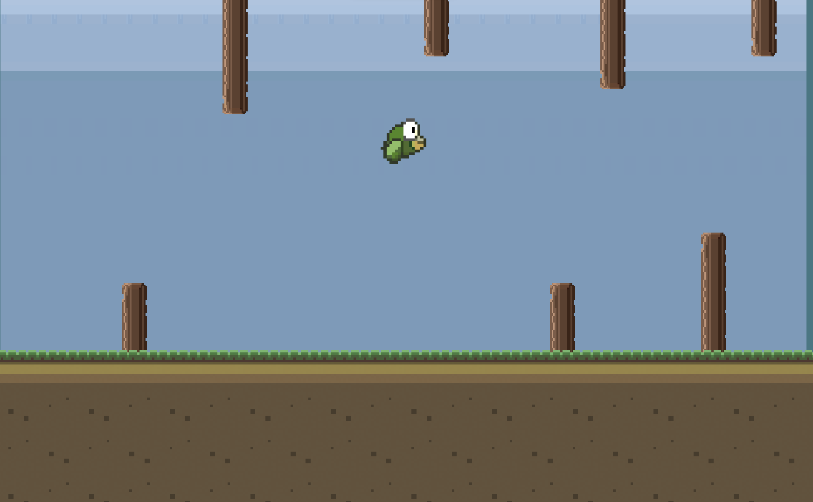

<h1 align="Center"> Flappy-Bird Game </h1>

<h5 align="center"> Project Assignment 5 - Computer Game Development and Animation ,<a href="https://nitw.ac.in/"> NITW</a> (Winter 2021) </h5>

<!-- ABOUT THE PROJECT -->
<h2 id="about-the-project"> :pencil: About The Project</h2>

 
  For those of you not familiar with Snake game, Flappy Bird is an arcade-style game in which the player controls the bird Faby, which moves persistently to the right. The player is tasked with navigating Faby through pairs of pipes that have equally sized gaps placed at random heights. Faby automatically descends and only ascends when the player taps the touchscreen. Each successful pass through a pair of pipes awards the player one point. Colliding with a pipe or the ground ends the gameplay. During the game over screen, the player is awarded a bronze medal if they reached ten or more points, a silver medal from twenty points, a gold medal from thirty points, and a platinum medal from forty points.

<!-- OVERVIEW -->
<h2 id="overview"> :cloud: Overview</h2>

 
  In this project, the Flappy Bird Moves to right continiuosly unless you touch win line , all the pipes are aligned at different position and the they keep move updow with different speeds and also gameoverscreen which shows after you di or win game.

<!-- PROJECT FILES DESCRIPTION -->
<h2 id="language-and-tools"> 💻 Language and Tools Used</h2>

<ul>
  <li><b>C#</b> - For Coding Part and Libraries.</li>
  <li><b>Visual Studio Code</b> - Text Editor For Running C# Codes.</li>
  <li><b>Unity Engine</b> - For Handling Scripts with Runnable Environment.</li>
</ul>

<!-- PROJECT FILES DESCRIPTION -->
<h2 id="project-files-description"> :floppy_disk: Project Files Description</h2>

<ul>
  <li><b>Scripts/Bird.cs</b> - Here Movement of Bird and its behaviour are defined.</li>
  <li><b>Scripts/CameraFollow.cs</b> - It Keeps the camera follow along with bird.</li>
  <li><b>Scripts/ObstacleScript.cs</b> - This Maintains the Obstacle Pipe which are moving down and up with different speeds.</li>
</ul>

 
 <h2 id="project-files-description"> ⏯️ How to Run Game</h2>
 <ul>
  <li><b>STEP-1 </b> - To Download Source Code and Playable Build click [Download](https://drive.google.com/drive/folders/1Aeiwm-NYEDG-VxkZVJBNHitLlna0a2yJ?usp=sharing).</li>
  <li><b>STEP-2 </b> - Extract the **Flappy-Bird Build.zip** for Playable Content and **Flappy Bird Source.zip** to see Source Code Content.</li>
  <li><b>STEP-3 </b> - Open Extracted Folder Than double Click on **Flappy Bird.exe** to play game.</li>
  <li><b>STEP-4 </b> - Enjoy the Game!.</li>
</ul>

