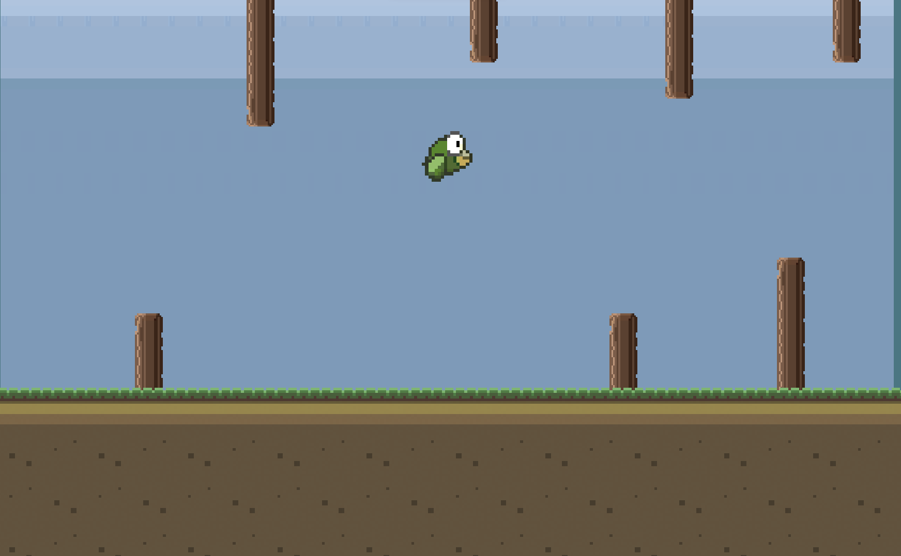

<h1 align="Center"> Flappy-Bird Game </h1>

<h5 align="center"> Project Assignment 5 - Computer Game Development and Animation, <a href="https://nitw.ac.in/"> NITW</a> (Winter 2021) </h5>

> Note: This is a scripts-only Unity sample/reference project -- the full Unity project and playable build are not distributed here.

<!-- ABOUT THE PROJECT -->
<h2 id="about-the-project"> :pencil: About The Project</h2>

 
  For those of you not familiar with Flappy Bird, it is an arcade-style game in which the player controls the bird Faby, which moves persistently to the right. The player is tasked with navigating Faby through pairs of pipes that have equally sized gaps placed at random heights. Faby automatically descends and only ascends when the player taps the touchscreen. Each successful pass through a pair of pipes awards the player one point. Colliding with a pipe or the ground ends the gameplay. During the game over screen, the player is awarded a bronze medal if they reached ten or more points, a silver medal from twenty points, a gold medal from thirty points, and a platinum medal from forty points.

<!-- OVERVIEW -->
<h2 id="overview"> :cloud: Overview</h2>

 
  In this project, the Flappy Bird moves to the right continuously until you reach the win line. All the pipes are aligned at different positions and keep moving up and down with different speeds, and a game-over screen shows after you die or win the game.

<!-- PROJECT FILES DESCRIPTION -->
<h2 id="language-and-tools"> 💻 Language and Tools Used</h2>

<ul>
  <li><b>C#</b> - For Coding Part and Libraries.</li>
  <li><b>Visual Studio Code</b> - Text Editor For Running C# Codes.</li>
  <li><b>Unity Engine</b> - For Handling Scripts with Runnable Environment.</li>
</ul>

<!-- PROJECT FILES DESCRIPTION -->
<h2 id="project-files-description"> :floppy_disk: Project Files Description</h2>

<ul>
  <li><b>Scripts/Bird.cs</b> - Defines the movement of the bird and its behaviour.</li>
  <li><b>Scripts/CameraFollow.cs</b> - Keeps the camera following along with the bird.</li>
  <li><b>Scripts/ObstacleScript.cs</b> - Maintains the obstacle pipes, which move up and down at different speeds.</li>
</ul>

 
 <h2 id="using-the-scripts"> Using the Scripts</h2>
 <ul>
  <li>Create a new 2D project in Unity (2020 LTS or newer works fine).</li>
  <li>Copy the C# files from the <b>Scripts/</b> folder into your project's <b>Assets/Scripts/</b> folder.</li>
  <li>Attach <b>Bird.cs</b> to your bird (with a Rigidbody2D), <b>CameraFollow.cs</b> to the main camera (set the bird as target), and <b>ObstacleScript.cs</b> to each pipe obstacle.</li>
</ul>

